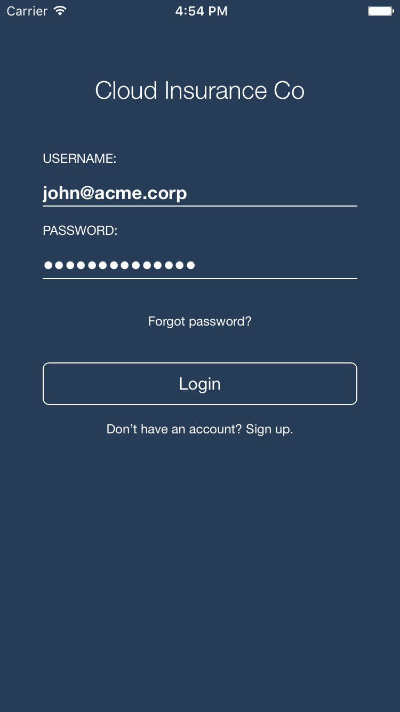
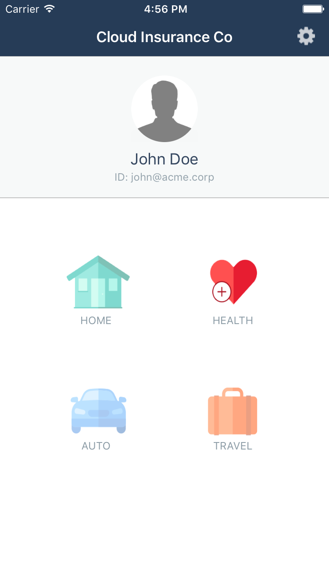
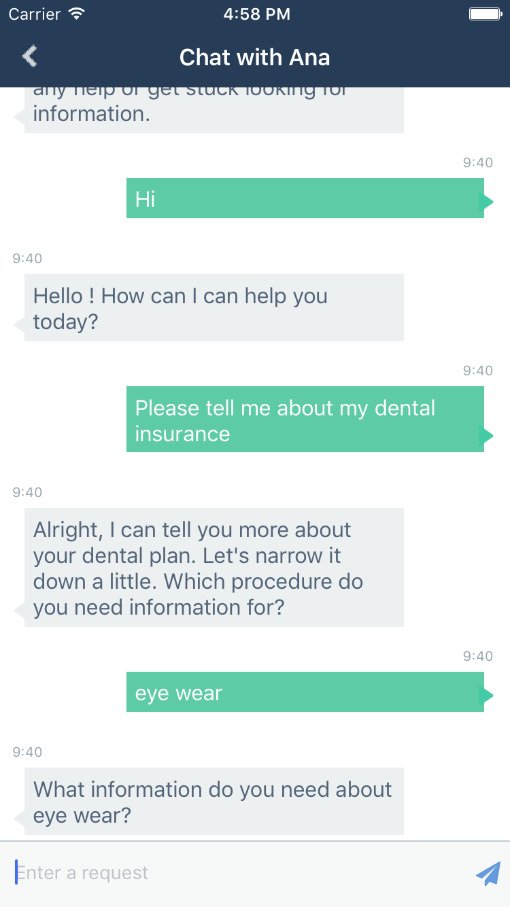

# Cloud Insurance Co. - Aplicação iOS

[](https://travis-ci.org/IBM-Bluemix/insurance-bot-ios)

Esse repositório é parte do projeto maior [Cloud Insurance Co.](https://github.com/IBM-Bluemix/cloudco-insurance).

# Visão geral

Um app nativo de iOS para interagir com o chatbot integrado no app [Cloud Insurance Co.](https://github.com/IBM-Bluemix/cloudco-insurance).





## Requisitos da aplicação

* XCode 8.0, iOS 10, Swift 3
* [Gerenciador de dependências Carthage](https://github.com/Carthage/Carthage/releases)

## Rodando a aplicação no simulador de iOS

1. O app depende do [App do Bot de Cloud Insurance](https://github.com/IBM-Bluemix/insurance-bot). Certifique-se de enviá-lo ao Bluemix primeiro. O caminho simples do envio é usar a [Toolchain de cloud insurance](https://github.com/IBM-Bluemix/insurance-toolchain).

1. Certifique-se que o Carthage esteja instalado em sua IDE. Você pode adquirir a última versão [neste link](https://github.com/Carthage/Carthage/releases).

1. Clone a aplicação para seu ambiente de trabalho pelo terminal de comandos usando o seguinte comando:

  ```
  git clone https://github.com/IBM-Bluemix/insurance-bot-ios.git
  ```

  * ou baixe e extraia o código fonte [deste arquivo](https://github.com/IBM-Bluemix/insurance-bot-ios/archive/master.zip)

1. Muda o diretório de checkout

  ```
  cd insurance-bot-ios
  ```

1. Pega as dependências

  ```
  carthage bootstrap --platform iOS --no-use-binaries
  ```

1. Abra o projeto XCode `insurance-mobile.xcodeproj`

1. Edite `insurance-mobile/configureMe.plist` e substitua a propriedade `default_api_host` com o local em que você enviou o app `insurance-bot`.

1. Execute o app

## Licença

Veja o [arquivo de licença](License.txt) para informação sobre a licença.
